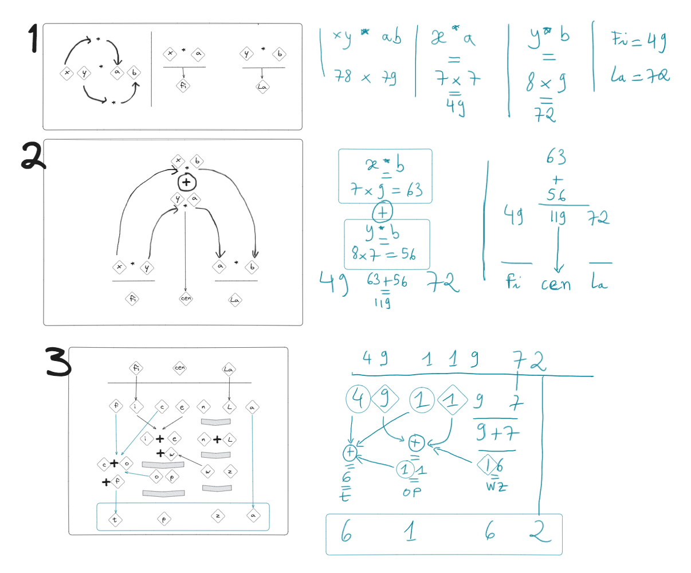

# python-math-trick-2
My second attempt at coding the logic behind a math trick: how to multiply any two 2-digits numbers. 

SOURCE:
The logic is from a YouTube video: https://youtu.be/H98sVfOOK9k?si=aWz8zuMkvl6eumik (in French). 

WHAT IS IT:
This is not a trick intended for code efficiency. It is a trick to help anyone who wants
to quickly calculate the multiplication of any 2 numbers that are 2-digits numbers, like 78 and 91, 
as long they are both > 9 and < 100 the trick will work. So this is more of a no-calculator-available solution. 

WHY?
This is the second attempt at coding the logic behind a math trick, and this one is a little more complicated.
Because it is not based on a 2-digits number multiplied by itself. 

I was curious to see if I could pull it off in the first attempt and the sense of accomplishment I felt
once finished was great, so I decided to continue with math tricks. 

OPPORTUNITY TO LEARN
This is great for me to learn collections manipulation, int/str methods and manipulation, and to practice on
basic conditionals and loops. 

I also found myself interested in how I could improve the user experience delivered by the bare 
terminal UI of a code editor. This meant adding some code like a time.sleep to mimic a computer thinking
process, to add ANSII codes to clean the terminal for visual comfort, and better structuring my prints
and inputs' strings. 

I learnt a lot more than that: 
Git in VScode: basic GIT process (repo creation, commits)
VScode: setting up a virtual environment and install modules.
VScode: setting up and customization: formatter, settings.json, pylance, etc. 

VISUALISATION OF THE LOGIC
I started to develop a preparation process before starting to code. I make a mind map of the logic I am
trying to break down and code. This helps in many ways, first is better learning of the logic, better
understanding and remembering too. It also serves as a reference if I need a refresher. 

I will not describe the logic behind here, I prefer to do it in the main file instead. This way I add
numbered bullet points that I can then use in the code for better code comprehension. I did this in my
first attempt and I found it very helpful. 